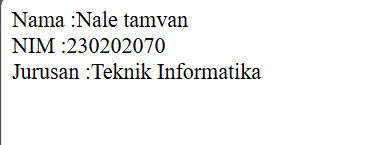

# PWEB 2

## Object Oriented Programming


### PENGERTIAN OOP
<div align='justify'>
Penggunaan kelas dan objek adalah inti dari pemrograman berorientasi objek
(OOP). Dalam PHP, kelas digunakan untuk mendefinisikan struktur dan perilaku objek,
sedangkan objek adalah instansiasi dari kelas tersebut. Dengan memanfaatkan kelas
dan objek, kode dapat diorganisir dengan lebih baik, lebih mudah dipelihara, dan dapat
digunakan kembali.
<hr>

## <div align ="center">Pertemuan 1 dan 2 <br>Konsep Kelas dan Objek dalam PHP</div>

### + Class(kelas)
- Struktur atau blueprint yang mendefinisikan atribut dan metode yang dimiliki
oleh objek.
- Atribut atau properties adalah variabel yang menyimpan data untuk objek.
- Metode adalah fungsi yang ditentukan dalam kelas yang dapat dipanggil oleh Objek
### + Objek

- Instansiasi dari kelas.
- Memiliki akses ke atribut dan metode yang didefinisikan dalam kelas.

### + Atribut dan Metode

- Atribut: Menyimpan data atau keadaan dari objek.
- Metode: Operasi atau fungsi yang dilakukan oleh objek.
<hr>

### 1. Membuat class(kelas) dan atribut

``` php

class Dosen{
    //Atribut
    public $nama;
    public $nip;
    public $matakuliah;
}
```
Dalam potongan coding diatas dapat disimpulkan bahwa programmer menjadikan 'Dosen' sebagai nama class dengan atribut $nama , $nip, $matakuliah. Dalam kasus ini atribut bersifat public yang berarti atribut tersebut dapat di akses dari mana saja.

### 2. Penginialisasian method (Construct)
``` php
 public function __construct($nama, $nip, $matakuliah)
    {
        $this->nama = $nama;
        $this->nip = $nip;
        $this->matakuliah = $matakuliah;
    }
```
Perintah ' __construct ' memiliki fungsi sebagai nilai awal dari hasil pengeksekusian objek. Dalam pembuatan construct dapat menggunakan 2 metode yaitu metode dinamis dan non dinamis.
- Dinamis : construct memiliki parameter dan hasilnya dapat berubah rubah saat eksekusi objek. Seperti potongan coding diatas

- Non Dinamis : construct tidak memiliki parameter dan hasilnya tidak dapat diuba saat eksekusi objek

contoh metode Non Dinamis :
``` php
 public function __construct()
    {
        $this->nama = "Nale";
        $this->nip = "230202012";
        $this->matakuliah = "MTK";
    }
```
Dalam potongan koding diatas pada saat pengeksekusian, hasilnya tidak akan berubah karena isi dari atribut atribut sudah di inialisasi dari awal

### 3. Pembuatan method/function
``` php
//Penambahan metode
    public function tampilkanDosen(){
        return "Nama = $this->nama<br>
                NIP  = $this->nip<br>
                Matakuliah = $this->matakuliah";
    }
```
Function atau method merupakan operasi atau fungsi yang dilakukan oleh objek

### 4. Pembuatan objek baru

``` php
    //instanisasi
    $dosen1 = new Dosen("Danur", "1234567890", "Matdis");
    echo $dosen1->tampilkanDosen();
    ?>
```
Perintah "new Dosen" diartikan bahwa kita akan membuat objek baru dengan isi "Danur", "1234567890", "Matdis"

### HASIL CODING FULL
``` php
<?php
class Dosen{
    //Atribut
    public $nama;
    public $nip;
    public $matakuliah;

    //Construct
    public function __construct($nama, $nip, $matakuliah)
    {
        $this->nama = $nama;
        $this->nip = $nip;
        $this->matakuliah = $matakuliah;
    }
    //Penambahan metode
    public function tampilkanDosen(){
        return "Nama = $this->nama<br>
                NIP  = $this->nip<br>
                Matakuliah = $this->matakuliah";
    }
}
    //instanisasi
    $dosen1 = new Dosen("Danur", "1234567890", "Matdis");
    echo $dosen1->tampilkanDosen();
    ?>
```

###  5. OUTPUT

<hr>

## <div align ="center">Pertemuan 3 dan 4 <br>Mampu Mengidentifikasi dan Menjelaskan Prinsip Dasar OOP </div>


### 1. Membuat Class dan Object

```php

<?php
//membuat class dan atribut
class Mahasiswa {
    public $nama;
    public $nim;
    public $jurusan;

    //Pembuatan nilai awal
    public function __construct($nama, $nim, $jurusan) {
        $this->nama = $nama;
        $this->nim = $nim;
        $this->jurusan = $jurusan;
    }
    // penambahan method
    public function tampilkanData() {
        return "Nama : $this->nama . <br>
                NIM : $this->nim . <br>
                Jurusan : $this->jurusan";
    }
}
    // Pembuatan objek baru
    $nale= new Mahasiswa ("Nale", "230202070", "Mesin");
    echo $nale->tampilkanData();
?>
```
### Output:


### 2. Encapsulation
Encapsulation adalah pembungkusan data dan method yang digunakan untuk menyusun kelas dan agar tak terekspos ke luar.
```php
<?php
//membuat class dan atribut
class Mahasiswa {
    private $nama;
    private $nim;
    private $jurusan;

    //Pembuatan nilai awal
    public function __construct($nama, $nim, $jurusan) {
        $this->nama = $nama;
        $this->nim = $nim;
        $this->jurusan = $jurusan;
    }//getter
    public function getNama() {
        return $this->nama;
    }//setter
    public function setNama($nama) {
        $this->nama = $nama;
    }//getter
    public function getNim() {
        return $this->nim;
    }//setter
    public function setNim($nim) {
        $this->nim = $nim;
    }//getter
    public function getJurusan() {
        return $this->jurusan;
    }//setter
    public function setJurusan($jurusan) {
        $this->jurusan = $jurusan;
    }

}
//Membuat Objek baru
$nale = new Mahasiswa ("kosong", "kosong", "kosong");

//penggunaan setter
$nale->setNama("Nale tamvan");
$nale->setNim("230202070");
$nale->setJurusan("Teknik Informatika");

//pengunaan geter
echo "Nama :" . $nale->getNama() . "<br>"; 
echo "NIM :" . $nale->getNim()  . "<br>"; 
echo "Jurusan :" . $nale->getJurusan(); 

?>
```
### Output:


### 3. Inheritance
Inheritance adalah konsep di mana sebuah kelas dapat mewarisi atribut dan metode dari kelas lain. Dalam inheritance terdapat istilah main class (induk) dan sub class (anak).

- Main class: Class utama yang biasanya memiliki sifat asli yangn nantinya diturunkan ke sub class
- Sub class: Class yang mewarisi atribut dan metode dari main class
<br>

``` php
<?php
//membuat class dan atribut
class Mahasiswa{
    private $nama;
    private $nim;
    private $jurusan;

    //Pembuatan nilai awal
    public function __construct($nama, $nim, $jurusan) {

        $this->nama = $nama;
        $this->nim = $nim;
        $this->jurusan = $jurusan;
    }
    // penambahan method
    public function tampilkanData() {
        return "Nama : $this->nama . <br>
                NIM : $this->nim . <br>
                Jurusan : $this->jurusan";
    }//getter
    public function getNama() {
        return $this->nama;
    }//setter
    public function setNama($nama) {
        $this->nama = $nama;
    }//getter
    public function getNim() {
        return $this->nim;
    }//setter
    public function setNim($nim) {
        $this->nim = $nim;
    }//getter
    public function getJurusan() {
        return $this->jurusan;
    }//setter
    public function setJurusan($jurusan) {
        $this->jurusan = $jurusan;
    }
}

//Pembuatan class pengguna 
class Pengguna{

    //Disini variabel bersifat protected karena yang dapat mengambil data variabel tersebut adalah class turunan dari class penggun
    protected $nama;

    //Inialisasi
    public function __construct($nama)
    {
        $this->nama = $nama;
    }
    //Pembuatan getter
    public function getNama() {
        return $this->nama;
    }
}

// Pembuatan class Dosen yang merupakan turunan dari class pengguna
class Dosen extends Pengguna{
    private $matakuliah;
    
    //Inialisasi
    public function __construct( $nama, $matakuliah)
    {
    
    //Parent disini merujuk pada variabel yang sudah ada di class pengguna
    parent::__construct($nama);
    $this->matakuliah = $matakuliah;
    }
    public function getMatakuliah(){
        return $this->matakuliah;
    }
}
//Pembuatan Objek baru
$nale = new Dosen("Nale keren","Jepang");

//Pengunaan Getter
echo $nale->getNama() . "<br>";
echo $nale->getMatakuliah()  . "<br>";
?>
```
### Hasil:


### 4. Polymorphism
Polymorphism adalah kemampuan suatu objek untuk mengambil bentuk yang berbeda walaupun memiliki method yang sama.
```php
<?php
//membuat class dan atribut
class Mahasiswa extends Pengguna {
    private $nim;
    private $jurusan;

    //Pembuatan nilai awal
    public function __construct($nama, $nim, $jurusan) {

        //Parent disini merujuk pada atribut yang diturunkan oleh main class
        parent::__construct($nama);
        $this->nim = $nim;
        $this->jurusan = $jurusan;
    }
    // penambahan method
    public function tampilkanData() {
        return "Nama : $this->nama <br>
                NIM : $this->nim <br>
                Jurusan : $this->jurusan";
    }//getter
    public function getNama() {
        return $this->nama;
    }//setter
    public function setNama($nama) {
        $this->nama = $nama;
    }//getter
    public function getNim() {
        return $this->nim;
    }//setter
    public function setNim($nim) {
        $this->nim = $nim;
    }//getter
    public function getJurusan() {
        return $this->jurusan;
    }//setter
    public function setJurusan($jurusan) {
        $this->jurusan = $jurusan;
    }//Pembuatan method 
    public function aksesFitur(){
        echo "Data dapat diakses mahasiswsa";
    }
}

//pembuatan class pengguna
class Pengguna {

    //disini variable nama bersifat protected karena variabel ini akan memiliki turunan yang nantinya akan mengambil variabel nama
    protected $nama;

    //inialisasi
    public function __construct($nama)
    {
        $this->nama = $nama;
    }

    //Pembuatan getter
    public function getNama() {
        return $this->nama;
    }

    //pembuatan method
    public function aksesFitur(){
        echo "";
    }
}

//Pembuatn class dosen yang merupakan turunan dari pengguna
class Dosen extends Pengguna{
    private $matakuliah;
    
    //inialisasi
    public function __construct( $nama, $matakuliah)
    {
    
    //Parent disini merujuk pada atribut yang diturunkan oleh main class
    parent::__construct($nama);
    $this->matakuliah = $matakuliah;
    }
    //Pembuatan method matkul
    public function getMatakuliah(){
        return $this->matakuliah;
    }
    //pembuatan method
    public function aksesFitur(){
        echo "Data dapat diakses dosen";
    }
}

//pembuatan objek baru
$nale = new Dosen("Nale keren","Jepang");

echo $nale->getNama() . "<br>";
echo $nale->getMatakuliah()  . "<br>";

//pemanggilan fungsi
$nale->aksesFitur() . "<br>";
echo "<br>";
echo "<br>";

//pembuatan objek baru
$nale1 = new Mahasiswa("Nale", 2302020203, "MJJJ <br>") ;
echo $nale1->tampilkanData() . "<br";
echo "<br>";

//pemanggilan fungsi
$nale1->aksesFitur();
?>
```
### Output:


### 5. Abstract
Abstarct adalah sebuah prisip yang digunakan untuk menghilangkan atau menghapus karakteristik dari suatu objek agar mengurangi kompleksitasnya atau kerumitan.

Disini saya mengubah isi mahasiswa karena untuk mempermudah pemb
```php

<?php

//Pembuatan abstarct class Pengguna
abstract class Pengguna{

    //disini atribuut bersifat protected
    protected $nama;

    //pembuatan consturct
    public function __construct($nama)
    {
        $this->nama = $nama;
    }

    //pembuatan method
    abstract public function aksesFitur ();
}

//Pembuatan class Dosen yang merupkan turunan dari class pengguna
class Dosen extends Pengguna {

    //disini atribut bersifat private
    private $matakuliah;

    //Pembuatan public function consturct
    public function __construct($nama,$matakuliah){

        //Parent disini merujuk pada class pengguna karena variabel nama merupakan turunan dari class pengguna
        parent:: __construct($nama);
        $this->matakuliah = $matakuliah;
    }
    
    //Pembuatan method aksesFitur
    public function aksesFitur() {
        return "Halo nama saya"." ". $this->nama . " "."<br>saya merupakan dosen pengajar matkul"." ". $this->matakuliah .", "."<br>disini saya dapat mengkases data dosen dan mahasiswa.";
    }

}

//pembuatan class mahasiswa yang merupakan turunan dari class pengguna
class Mahasiswa extends Pengguna {
    private $nim;
    private $jurusan;

    //Pembuatan fungsi construct
    public function __construct($nama,$nim,$jurusan){
        parent::__construct($nama);
        $this->nim = $nim;
        $this->jurusan =$jurusan;
    }//getter
    public function getNama() {
        return $this->nama;
    }//setter
    public function setNama($nama) {
        $this->nama = $nama;
    }//getter
    public function getNim() {
        return $this->nim;
    }//setter
    public function setNim($nim) {
        $this->nim = $nim;
    }//getter
    public function getJurusan() {
        return $this->jurusan;
    }//setter
    public function setJurusan($jurusan) {
        $this->jurusan = $jurusan;
    }

    //Pembuatan fungsi aksesFitur
    public function aksesFitur() {
        return "Halo nama saya"." ". $this->getNama() ." "."<br>saya merupakan mahasiswa PNC dengan NIM"." ". $this->getNim() ." "."<br>dari jurusan" ." ". $this->getJurusan() .", "."disini saya dapat mengkases data mahasiswa saja" ;
    }
    
}

 //Pembuatan objek baru
$nale = new Dosen ("Uzumaki Ujang", "Tenaga Nuklir");
echo $nale->aksesFitur() . "<br>";
echo "<br>";

//Pembuatan objek baru
$nale1 = new Mahasiswa ("kosong", "kosong", "kosong");
//penggunaan setter
$nale1->setNama("Emiya Nalindra");
$nale1->setNim("230202070");
$nale1->setJurusan("Teknik Informatika");

echo $nale1->aksesFitur();
?>
?>
```
### Output:

</div>