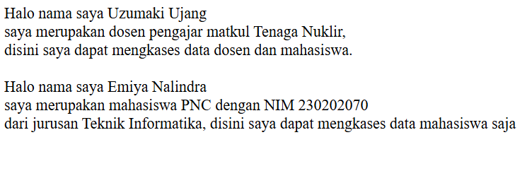

# PWEB 2

## Object Oriented Programming


### PENGERTIAN OOP
<div align='justify'>
Penggunaan kelas dan objek adalah inti dari pemrograman berorientasi objek
(OOP). Dalam PHP, kelas digunakan untuk mendefinisikan struktur dan perilaku objek,
sedangkan objek adalah instansiasi dari kelas tersebut. Dengan memanfaatkan kelas
dan objek, kode dapat diorganisir dengan lebih baik, lebih mudah dipelihara, dan dapat
digunakan kembali.
<hr>

## <div align ="center">Pertemuan 1 dan 2 <br>Konsep Kelas dan Objek dalam PHP</div>

### + Class(kelas)
- Struktur atau blueprint yang mendefinisikan atribut dan metode yang dimiliki
oleh objek.
- Atribut atau properties adalah variabel yang menyimpan data untuk objek.
- Metode adalah fungsi yang ditentukan dalam kelas yang dapat dipanggil oleh Objek
### + Objek

- Instansiasi dari kelas.
- Memiliki akses ke atribut dan metode yang didefinisikan dalam kelas.

### + Atribut dan Metode

- Atribut: Menyimpan data atau keadaan dari objek.
- Metode: Operasi atau fungsi yang dilakukan oleh objek.
<hr>

### 1. Membuat class(kelas) dan atribut

``` php

class Dosen{
    //Atribut
    public $nama;
    public $nip;
    public $matakuliah;
}
```
Dalam potongan coding diatas dapat disimpulkan bahwa programmer menjadikan 'Dosen' sebagai nama class dengan atribut $nama , $nip, $matakuliah. Dalam kasus ini atribut bersifat public yang berarti atribut tersebut dapat di akses dari mana saja.

### 2. Penginialisasian method (Construct)
``` php
 public function __construct($nama, $nip, $matakuliah)
    {
        $this->nama = $nama;
        $this->nip = $nip;
        $this->matakuliah = $matakuliah;
    }
```
Perintah ' __construct ' memiliki fungsi sebagai nilai awal dari hasil pengeksekusian objek. Dalam pembuatan construct dapat menggunakan 2 metode yaitu metode dinamis dan non dinamis.
- Dinamis : construct memiliki parameter dan hasilnya dapat berubah rubah saat eksekusi objek. Seperti potongan coding diatas

- Non Dinamis : construct tidak memiliki parameter dan hasilnya tidak dapat diuba saat eksekusi objek

contoh metode Non Dinamis :
``` php
 public function __construct()
    {
        $this->nama = "Nale";
        $this->nip = "230202012";
        $this->matakuliah = "MTK";
    }
```
Dalam potongan koding diatas pada saat pengeksekusian, hasilnya tidak akan berubah karena isi dari atribut atribut sudah di inialisasi dari awal

### 3. Pembuatan method/function
``` php
//Penambahan metode
    public function tampilkanDosen(){
        return "Nama = $this->nama<br>
                NIP  = $this->nip<br>
                Matakuliah = $this->matakuliah";
    }
```
Function atau method merupakan operasi atau fungsi yang dilakukan oleh objek

### 4. Pembuatan objek baru

``` php
    //instanisasi
    $dosen1 = new Dosen("Danur", "1234567890", "Matdis");
    echo $dosen1->tampilkanDosen();
    ?>
```
Perintah "new Dosen" diartikan bahwa kita akan membuat objek baru dengan isi "Danur", "1234567890", "Matdis"

### HASIL CODING FULL
``` php
<?php
class Dosen{
    //Atribut
    public $nama;
    public $nip;
    public $matakuliah;

    //Construct
    public function __construct($nama, $nip, $matakuliah)
    {
        $this->nama = $nama;
        $this->nip = $nip;
        $this->matakuliah = $matakuliah;
    }
    //Penambahan metode
    public function tampilkanDosen(){
        return "Nama = $this->nama<br>
                NIP  = $this->nip<br>
                Matakuliah = $this->matakuliah";
    }
}
    //instanisasi
    $dosen1 = new Dosen("Danur", "1234567890", "Matdis");
    echo $dosen1->tampilkanDosen();
    ?>
```

###  5. OUTPUT

<hr>

## <div align ="center">Pertemuan 3 dan 4 <br>Mampu Mengidentifikasi dan Menjelaskan Prinsip Dasar OOP </div>

### <div align ="center">  Instruksi kerja dan Tugas </div>

### 1. Membuat Class dan Object

```php

<?php
//membuat class dan atribut
class Mahasiswa {
    public $nama;
    public $nim;
    public $jurusan;

    //Pembuatan nilai awal
    public function __construct($nama, $nim, $jurusan) {
        $this->nama = $nama;
        $this->nim = $nim;
        $this->jurusan = $jurusan;
    }
    // penambahan method
    public function tampilkanData() {
        return "Nama : $this->nama . <br>
                NIM : $this->nim . <br>
                Jurusan : $this->jurusan";
    }
}
    // Pembuatan objek baru
    $nale= new Mahasiswa ("Nale", "230202070", "Mesin");
    echo $nale->tampilkanData();
?>
```
### Output:


### 2. Encapsulation
Encapsulation adalah pembungkusan data dan method yang digunakan untuk menyusun kelas dan agar tak terekspos ke luar. Encapsulation biasanya ditandai dengan adanya 'private/public/protected' pada variabel.
```php
<?php
//membuat class dan atribut
class Mahasiswa {
    private $nama;
    private $nim;
    private $jurusan;

    //Pembuatan nilai awal
    public function __construct($nama, $nim, $jurusan) {
        $this->nama = $nama;
        $this->nim = $nim;
        $this->jurusan = $jurusan;
    }//getter
    public function getNama() {
        return $this->nama;
    }//setter
    public function setNama($nama) {
        $this->nama = $nama;
    }//getter
    public function getNim() {
        return $this->nim;
    }//setter
    public function setNim($nim) {
        $this->nim = $nim;
    }//getter
    public function getJurusan() {
        return $this->jurusan;
    }//setter
    public function setJurusan($jurusan) {
        $this->jurusan = $jurusan;
    }

}
//Membuat Objek baru
$nale = new Mahasiswa ("kosong", "kosong", "kosong");

//penggunaan setter
$nale->setNama("Nale tamvan");
$nale->setNim("230202070");
$nale->setJurusan("Teknik Informatika");

//pengunaan geter
echo "Nama :" . $nale->getNama() . "<br>"; 
echo "NIM :" . $nale->getNim()  . "<br>"; 
echo "Jurusan :" . $nale->getJurusan(); 

?>
```
### Output:


### 3. Inheritance
Inheritance adalah konsep di mana sebuah kelas dapat mewarisi atribut dan metode dari kelas lain. Dalam inheritance terdapat istilah main class (induk) dan sub class (anak).

- Main class: Class utama yang biasanya memiliki sifat asli yangn nantinya diturunkan ke sub class
- Sub class: Class yang mewarisi atribut dan metode dari main class
<br>

``` php
<?php
//membuat class dan atribut
class Mahasiswa{
    private $nama;
    private $nim;
    private $jurusan;

    //Pembuatan nilai awal
    public function __construct($nama, $nim, $jurusan) {

        $this->nama = $nama;
        $this->nim = $nim;
        $this->jurusan = $jurusan;
    }
    // penambahan method
    public function tampilkanData() {
        return "Nama : $this->nama . <br>
                NIM : $this->nim . <br>
                Jurusan : $this->jurusan";
    }//getter
    public function getNama() {
        return $this->nama;
    }//setter
    public function setNama($nama) {
        $this->nama = $nama;
    }//getter
    public function getNim() {
        return $this->nim;
    }//setter
    public function setNim($nim) {
        $this->nim = $nim;
    }//getter
    public function getJurusan() {
        return $this->jurusan;
    }//setter
    public function setJurusan($jurusan) {
        $this->jurusan = $jurusan;
    }
}

//Pembuatan class pengguna 
class Pengguna{

    //Disini variabel bersifat protected karena yang dapat mengambil data variabel tersebut adalah class turunan dari class penggun
    protected $nama;

    //Inialisasi
    public function __construct($nama)
    {
        $this->nama = $nama;
    }
    //Pembuatan getter
    public function getNama() {
        return $this->nama;
    }
}

// Pembuatan class Dosen yang merupakan turunan dari class pengguna
class Dosen extends Pengguna{
    private $matakuliah;
    
    //Inialisasi
    public function __construct( $nama, $matakuliah)
    {
    
    //Parent disini merujuk pada variabel yang sudah ada di class pengguna
    parent::__construct($nama);
    $this->matakuliah = $matakuliah;
    }
    public function getMatakuliah(){
        return $this->matakuliah;
    }
}
//Pembuatan Objek baru
$nale = new Dosen("Nale keren","Jepang");

//Pengunaan Getter
echo $nale->getNama() . "<br>";
echo $nale->getMatakuliah()  . "<br>";
?>
```
### Hasil:


### 4. Polymorphism
Polymorphism adalah kemampuan suatu objek untuk mengambil bentuk yang berbeda walaupun memiliki method yang sama. 
```php
<?php
//membuat class dan atribut
class Mahasiswa extends Pengguna {
    private $nim;
    private $jurusan;

    //Pembuatan nilai awal
    public function __construct($nama, $nim, $jurusan) {

        //Parent disini merujuk pada atribut yang diturunkan oleh main class
        parent::__construct($nama);
        $this->nim = $nim;
        $this->jurusan = $jurusan;
    }
    // penambahan method
    public function tampilkanData() {
        return "Nama : $this->nama <br>
                NIM : $this->nim <br>
                Jurusan : $this->jurusan";
    }//getter
    public function getNama() {
        return $this->nama;
    }//setter
    public function setNama($nama) {
        $this->nama = $nama;
    }//getter
    public function getNim() {
        return $this->nim;
    }//setter
    public function setNim($nim) {
        $this->nim = $nim;
    }//getter
    public function getJurusan() {
        return $this->jurusan;
    }//setter
    public function setJurusan($jurusan) {
        $this->jurusan = $jurusan;
    }//Pembuatan method 
    public function aksesFitur(){
        echo "Data dapat diakses mahasiswsa";
    }
}

//pembuatan class pengguna
class Pengguna {

    //disini variable nama bersifat protected karena variabel ini akan memiliki turunan yang nantinya akan mengambil variabel nama
    protected $nama;

    //inialisasi
    public function __construct($nama)
    {
        $this->nama = $nama;
    }

    //Pembuatan getter
    public function getNama() {
        return $this->nama;
    }

    //pembuatan method
    public function aksesFitur(){
        echo "";
    }
}

//Pembuatn class dosen yang merupakan turunan dari pengguna
class Dosen extends Pengguna{
    private $matakuliah;
    
    //inialisasi
    public function __construct( $nama, $matakuliah)
    {
    
    //Parent disini merujuk pada atribut yang diturunkan oleh main class
    parent::__construct($nama);
    $this->matakuliah = $matakuliah;
    }
    //Pembuatan method matkul
    public function getMatakuliah(){
        return $this->matakuliah;
    }
    //pembuatan method
    public function aksesFitur(){
        echo "Data dapat diakses dosen";
    }
}

//pembuatan objek baru
$nale = new Dosen("Nale keren","Jepang");

echo $nale->getNama() . "<br>";
echo $nale->getMatakuliah()  . "<br>";

//pemanggilan fungsi
$nale->aksesFitur() . "<br>";
echo "<br>";
echo "<br>";

//pembuatan objek baru
$nale1 = new Mahasiswa("Nale", 2302020203, "MJJJ <br>") ;
echo $nale1->tampilkanData() . "<br";
echo "<br>";

//pemanggilan fungsi
$nale1->aksesFitur();
?>
```
### Output:


### 5. Abstract
Abstarct adalah sebuah prisip yang digunakan untuk menghilangkan atau menghapus karakteristik dari suatu objek agar mengurangi kompleksitasnya atau kerumitan. Abstract bersifat mutlak yang berarti jika ada suatu method pada main class yang bersifat abstarct, maka turunan nya harus menggunakan method tersebut. Jika tidak maka akan terjadi error.

Disini saya mengubah isi mahasiswa karena untuk mempermudah pemb
```php

<?php

//Pembuatan abstarct class Pengguna
abstract class Pengguna{

    //disini atribuut bersifat protected
    protected $nama;

    //pembuatan consturct
    public function __construct($nama)
    {
        $this->nama = $nama;
    }

    //pembuatan method
    abstract public function aksesFitur ();
}

//Pembuatan class Dosen yang merupkan turunan dari class pengguna
class Dosen extends Pengguna {

    //disini atribut bersifat private
    private $matakuliah;

    //Pembuatan public function consturct
    public function __construct($nama,$matakuliah){

        //Parent disini merujuk pada class pengguna karena variabel nama merupakan turunan dari class pengguna
        parent:: __construct($nama);
        $this->matakuliah = $matakuliah;
    }
    
    //Pembuatan method aksesFitur
    public function aksesFitur() {
        return "Halo nama saya"." ". $this->nama . " "."<br>saya merupakan dosen pengajar matkul"." ". $this->matakuliah .", "."<br>disini saya dapat mengkases data dosen dan mahasiswa.";
    }

}

//pembuatan class mahasiswa yang merupakan turunan dari class pengguna
class Mahasiswa extends Pengguna {
    private $nim;
    private $jurusan;

    //Pembuatan fungsi construct
    public function __construct($nama,$nim,$jurusan){
        parent::__construct($nama);
        $this->nim = $nim;
        $this->jurusan =$jurusan;
    }//getter
    public function getNama() {
        return $this->nama;
    }//setter
    public function setNama($nama) {
        $this->nama = $nama;
    }//getter
    public function getNim() {
        return $this->nim;
    }//setter
    public function setNim($nim) {
        $this->nim = $nim;
    }//getter
    public function getJurusan() {
        return $this->jurusan;
    }//setter
    public function setJurusan($jurusan) {
        $this->jurusan = $jurusan;
    }

    //Pembuatan fungsi aksesFitur
    public function aksesFitur() {
        return "Halo nama saya"." ". $this->getNama() ." "."<br>saya merupakan mahasiswa PNC dengan NIM"." ". $this->getNim() ." "."<br>dari jurusan" ." ". $this->getJurusan() .", "."disini saya dapat mengkases data mahasiswa saja" ;
    }
    
}

 //Pembuatan objek baru
$nale = new Dosen ("Uzumaki Ujang", "Tenaga Nuklir");
echo $nale->aksesFitur() . "<br>";
echo "<br>";

//Pembuatan objek baru
$nale1 = new Mahasiswa ("kosong", "kosong", "kosong");
//penggunaan setter
$nale1->setNama("Emiya Nalindra");
$nale1->setNim("230202070");
$nale1->setJurusan("Teknik Informatika");

echo $nale1->aksesFitur();
?>
```
### Output:


<hr>

## <div align ="center">Pertemuan 5 dan 6 <br>Mampu Menerapkan Konsep Inheritance, Polymorphism, Encapsulation, dan Abstraction dalam PHP </div>

### <div align ="center">  <b>Instruksi kerja</b>  </div>

### 1. Inheritance

```php
<?php

//Pembuatan class person
class Person{

    //disini variabel nama bersifat protected karena //variabel ini akan dipanggil diturunkan ke sbu class
    protected $name; 

    //inisialisasi
    public function __construct($name)
    {
        $this->name = $name;
    }

    //disini function getName akan diturunkan kepada class Student dan Teacher
    public function getName()
    { 
        return $this->name;
    }
}

//pembuatan class student yang merupakan turunan dari class person
class Student extends Person{

    //disini variabel student bersifat private karena variabel ini hanya akan digunakan di class ini
    private $studentID;

    //inisialisasi
    public function __construct( $name, $studentID)
    {
        //parent disini merujuk pada variabel nama di main class
        parent::__construct($name);
        $this->studentID=$studentID;
    }

    //getter
    public function getStudentID()
    {
        return "NPM SAYA " . $this->studentID;
    }
}

//instansiasi
$nale = new Student("NALE", 230202070);
echo "NAMA SAYA " . $nale->getName() . " " . $nale->getStudentID();

?>
```
### Output:


### 2. Polymorphism

```php

<?php

//Pembuatan class person
class Person{

    //disini variabel nama bersifat protected karena //variabel ini akan dipanggil diturunkan ke sbu class
    protected $name; 

    //inisialisasi
    public function __construct($name)
    {
        $this->name = $name;
    }
    
    //disini function getName akan diturunkan kepada class Student dan Teacher
    public function getName()
    { 
        return $this->name;
    }
}

//pembuatan class student yang merupakan turunan dari class person
class Student extends Person{

    //disini variabel student bersifat private karena variabel ini hanya akan digunakan di class ini
    private $studentID;

    //inisialisasi
    public function __construct( $name, $studentID)
    {
        //parent disini merujuk pada variabel nama di main class
        parent::__construct($name);
        $this->studentID=$studentID;
    }
    public function getStudent()
    {
        return $this->studentID;
    }

    //Polymorphism
    public function getName()
    {
        return "halo " . "Nama saya " . $this->name . " ". "  Dengan ID " . $this->studentID;
    }
}

//pembuatan class student yang merupakan turunan dari class person
class Teacher extends Person{

    //disini variabel teacherid bersifat private karena variabel ini hanya akan digunakan di class ini
    private $teacherID;

    //inisialisasi
    public function __construct( $name, $teacherID)
    {
        //parent disini merujuk pada variabel nama di main class
        parent::__construct($name);
        $this->teacherID=$teacherID;
    }

    //Polymorphism
    public function getName()
    {
        return "halo " . "Nama saya " . $this->name . " ". "  Dengan ID " . $this->teacherID;
    }
}

//instansiasi
$nale = new Student ("dimas", "2322");

echo $nale->getName() . "<br>";

$nale1= new Teacher("nale", "1221");

echo $nale1->getName();
?>
```
### Ouput:


### 3. Encapsulation
```php
<?php

//Pembuatan class person
class Person{

    //disini variabel nama bersifat protected karena //variabel ini akan dipanggil diturunkan ke sbu class
    protected $name; 

    //inisialisasi
    public function __construct($name)
    {
        $this->name = $name;
    }

    //disini function getName akan diturunkan kepada class Student dan Teacher
    public function getName()
    { 
        return $this->name;
    }
}

//pembuatan class student yang merupakan turunan dari class person
class Student extends Person{

    //disini variabel student bersifat private karena variabel ini hanya akan digunakan di class ini
    private $studentID;

    //inisialisasi
    public function __construct( $name, $studentID)
    {
        //parent disini merujuk pada variabel nama di main class
        parent::__construct($name);
        $this->studentID=$studentID;
    }

    //setter
    public function setStudentID($studentID)
    {
        $this->studentID=$studentID;
    }
    //getter
    public function getStudentID()
    {
        return $this->studentID;
    }
    //setter
    public function setName($name)
    {
        $this->name = $name;
    }
    //Polymorphism
    public function getName()
    {
        return "halo " . "Nama saya " . $this->name . " ". "  Dengan ID " . $this->studentID;
    }
}

//pembuatan class student yang merupakan turunan dari class person
class Teacher extends Person{

    //disini variabel teacherid bersifat private karena variabel ini hanya akan digunakan di class ini
    private $teacherID;

    //inisialisasi
    public function __construct( $name, $teacherID)
    {
        //parent disini merujuk pada variabel nama di main class
        parent::__construct($name);
        $this->teacherID=$teacherID;
    }

    //Polymorphism
    public function getName()
    {
        return "halo " . "Nama saya" . " " . $this->name . " ". "  Dengan ID " . $this->teacherID;
    }
}

//instansiasi
$nale1= new Student("nale", "1221");
echo $nale1->getName() . "<br>";
echo "<br>";

$nale1->setName("Nale gagah");
$nale1->setStudentID(44444);

echo $nale1->getName();
?>

```

### Output:


### 4. Abstract
```php
<?php
//Mmembuat class yang bersifat abstarct
abstract class Course{
    
    //membuat fungsing bersifat abstract
    abstract public function getCourseDetails();
}

class OnlineCourse{

    //Memanggil function dari class courese
    public function getCourseDetails()
    {
        return "Selamat datang di course online";
    }
}

class OfflineCourse{

    //Memanggil function dari class courese
    public function getCourseDetails()
    {
        return "Selamat datang di course offline";
    }
}

//instansiasi
$nale1= new OnlineCourse();
echo $nale1->getCourseDetails() . "<br>";
echo "<br>";

$nale2= new OfflineCourse();
echo $nale2->getCourseDetails() . "<br>";

?>
```

### Output:

<hr>

### <div align ="center">  <b>TUGAS</b>  </div>

### 1. Implementasikan kelas Person sebagai induk dari Dosen dan Mahasiswa.

```php
<?php

class Person {}
class Dosen extends Person {}
class Mahasiswa extends Person {}
?>
```

Dalam potongan code diatas saya membuat class person dan menjadikan nya sebagai main class atau induk. Selain itu, saya juga membuat 2 class yaitu class dosen dan mahasiswa yang merupakan sub class atau anakan dari class person.

### 2. Gunakan konsep Inheritance untuk membuat hierarki kelas yang memungkinkan Dosen dan Mahasiswa memiliki atribut dan metode yang sesuai dengan perannya.
```php
<?php

//Pembuatan class person
class Person {
    public $nama;
    public $umur;
    public $gender;

    //inisialisasi
    public function __construct($nama, $umur, $gender){
        $this->nama=$nama;
        $this->umur=$umur;
        $this->gender=$gender;
    }
}

//Pembuatan class dosen dimana class dosen merupakan turunan atau subclass dari class person
class Dosen extends Person {
    public $nidn;
    public $jabatan;

    //Pembuatan method construct
    public function __construct($nama, $umur, $gender, $nidn, $jabatan){
        parent ::__construct($nama, $umur,$gender);
        $this->nidn=$nidn;
        $this->jabatan=$jabatan;
    }
}

//Pembuatan class mahasiswa dimana class mahasiswa merupakan turunan atau subclass dari class person
class Mahasiswa extends Person {
    public $npm;
    public $ipk;

    ////Pembuatan method construct
    public function __construct($nama, $umur, $gender, $npm, $ipk){
        parent ::__construct($nama, $umur,$gender);
        $this->npm=$npm;
        $this->ipk=$ipk;
    }
}
?>
```
Selanjutnya saya memasukan semua atribut yang menurur saya penting di setiap class dan saya juga memasukan method construct untuk inialisasi nilai awal.
### + POINT PENTING !!!

- Alasan kenapa saya menggunakan "parent::_construct" karena saya ingin mengambil variabel $nama, $umur, $gender dari class `person`. Kenapa bisa diambil ? Karena class `dosen` merupakan turunan dari class `Person`. Hal ini dibuktikan dengan adanya "extend" pada pembuatan class.
```php 
    public function __construct($nama, $umur, $gender, $nidn, $jabatan){
        parent ::__construct($nama, $umur,$gender);
        $this->nidn=$nidn;
        $this->jabatan=$jabatan;
    }
```

- Sama halnya dengan class `dosen`, disini saya juga menggunakan "parent::_construct" untuk mengambil variabel $nama, $umur, $gender. Saya bisa mengambil dari dari class `person` karena class `mahasiswa` merupakan turunan dari class `person`.

```php
    public function __construct($nama, $umur, $gender, $npm, $ipk){
        parent ::__construct($nama, $umur,$gender);
        $this->npm=$npm;
        $this->ipk=$ipk;
    }
```
### 3. Terapkan Polymorphism dengan membuat metode getRole() di kelas Person dan override metode ini di kelas Dosen dan Mahasiswa untuk menampilkan peran yang berbeda.

```php
<?php

//Pembuatan class person
class Person {
    public $nama;
    public $umur;


    //inisialisasi
    public function __construct($nama, $umur){
        $this->nama=$nama;
        $this->umur=$umur;
    }

    //Pembuatan method getRole di class person
    public function getRole()
    {
        return " ";
    }
}
//Pembuatan class dosen dimana class dosen merupakan turunan atau subclass dari class person
class Dosen extends Person {
    public $nidn;
    public $jabatan;

    //Pembuatan method construct
    public function __construct($nama, $umur, $nidn, $jabatan){
        parent ::__construct($nama, $umur,);
        $this->nidn=$nidn;
        $this->jabatan=$jabatan;
    }
    public function getRole()
    {
        return "Nama saya " . $this->nama . ", saya berumur " . $this->umur . " tahun. <br>" . "Saya merupakan " . $this->jabatan . " dari PNC <br>" . "NIDN saya: " . $this->nidn ;
    }
}

//Pembuatan class mahasiswa dimana class mahasiswa merupakan turunan atau subclass dari class person
class Mahasiswa extends Person {
    public $npm;
    public $ipk;

    ////Pembuatan method construct
    public function __construct($nama, $umur, $npm, $ipk){
        parent ::__construct($nama, $umur);
        $this->npm=$npm;
        $this->ipk=$ipk;
    }

    //Pembuatan method getRole
    public function getRole()
    {
        return "Nama saya " . $this->nama . ", saya berumur " . $this->umur . " tahun. <br>" . "Saya merupakan mahasiswa PNC dengan NPM " . $this->npm . "<br>saya memiliki IPK: ". $this->ipk ;
    }
}

//Instansiasi
$nale = new Dosen("Komeng", 30 , 2020202, "Direktur" );
$nale1 = new Mahasiswa("Nale", 19 , 230202070, 3.8 );

echo $nale->getRole() . "<br>";
echo "<br>";
echo $nale1->getRole();
?>
```
Dalam kode di atas, kita dapat melihat bahwa class `Dosen` dan `Mahasiswa` sama sama memiliki method `getRole()` tetapi isinya berbeda kenapa ? karena ini merupakan efek polymorphism dimana jika kita membuat method di dalam main class maka method tersebut akan menurun ke anakan nya.

### output :


### + POINT PENTING !!!
- Di method `getRole()` pada class person saya kosongkan karena untuk mempermudah dan karena method di class person tidak saya panggil
```php
public function getRole()
    {
        return " ";
    }
```

- Saya memasukan method `getRole()` pada class dosen dan mahasiswa dengan tujuan pembuatan overriding.
```php
    public function getRole()
    {
        return "Nama saya " . $this->nama . ", saya berumur " . $this->umur . " tahun. <br>" . "Saya merupakan " . $this->jabatan . " dari PNC <br>" . "NIDN saya: " . $this->nidn ;
    }
```
### 4. Gunakan Encapsulation untuk melindungi atribut nidn di kelas Dosen dan nim di kelas Mahasiswa.

```php
<?php

//Pembuatan class person
class Person {
    protected $nama;
    protected $umur;

    //inisialisasi
    public function __construct($nama, $umur){
        $this->nama=$nama;
        $this->umur=$umur;
    }
    //getter
    public function getNama() {
    return $this->nama;
    }//setter
    public function setNama($nama) {
    $this->nama = $nama;
    }
    //getter
    public function getUmur() {
        return $this->umur;
    }//setter
    public function setUmur($umur) {
    $this->umur = $umur;
    }
    //Pembuatan method getRole di class person
    public function getRole()
    {
        return " ";
    }
}
//Pembuatan class dosen dimana class dosen merupakan turunan atau subclass dari class person
class Dosen extends Person {
    private $nidn;
    public $jabatan;

    //Pembuatan method construct
    public function __construct($nama, $umur, $nidn, $jabatan){
        parent ::__construct($nama, $umur,);
        $this->nidn=$nidn;
        $this->jabatan=$jabatan;
    }
    //getter
    public function getNidn() {
        return $this->nidn;
    }//setter
    public function setNidn($nidn) {
        $this->nidn = $nidn;
    }//getter
    public function getRole()
    {
        return "Nama saya " . $this->nama . ", saya berumur " . $this->umur . " tahun. <br>" . "Saya merupakan " . $this->jabatan . " dari PNC <br>" . "NIDN saya: " . $this->nidn ;
    }
}

//Pembuatan class mahasiswa dimana class mahasiswa merupakan turunan atau subclass dari class person
class Mahasiswa extends Person {
    private $nim;
    public $ipk;

    ////Pembuatan method construct
    public function __construct($nama, $umur, $nim, $ipk){
        parent ::__construct($nama, $umur);
        $this->nim=$nim;
        $this->ipk=$ipk;
    }
    public function getNim() {
        return $this->nim;
    }//setter
    public function setNim($nim) {
        $this->nim = $nim;
    }
    //Pembuatan method getRole
    public function getRole()
    {
        return "Nama saya " . $this->nama . ", saya berumur " . $this->umur . " tahun. <br>" . "Saya merupakan mahasiswa PNC dengan nim " . $this->nim . "<br>saya memiliki IPK: ". $this->ipk ;
    }
}

//Instansiasi
$nale = new Dosen("Komeng", 30 , 2020202, "Direktur" );
$nale1 = new Mahasiswa("Nale", 19 , 230202070, 3.8 );

//Penggunaan setter dan getter
$nale->setNama("Kuroko");
$nale->setUmur(28);
$nale->setNidn(101010);

$nale1->setNama("Nale");
$nale1->setUmur(20);
$nale1->setNim(230202070);

echo "Nama saya " . $nale->getNama() . "<br>";
echo " saya berumur " . $nale->getUmur() . "<br>";
echo " NIDN saya: " . $nale->getNidn() . "<br>";

echo "<br>";

echo "Nama saya " . $nale1->getNama() . "<br>";
echo " saya berumur " . $nale1->getUmur() . "<br>";
echo " saya merupakan mahasiswa PNC dengan nim " . $nale1->getNim() . "<br>";

```
Disini saya melakukan encapsulasi (pembungkusan) dengan cara mengubah atribut nidn di class dosen dan atribut nim di class mahasiswa, dari yang bersifat publice menjadi privat.
### Output:


### +POINT PENTING!!!
- Dalam encapsulasi itu terdapat istilah acces modifier yaitu Private, Public, Protected. Masing masikng acces modifier tersebut memiliki fungsinya masing masing.
1. Private, memiliki arti bahwa atribut tersebut hanya bisa digunakan di class yang dimiliki atribut tersebut
2. Public, memiliki arti bahwa atribut terssebut dapat digunakan di luar class tersebut.
3. Protected, memiliki arti bahwa atribut tersebut hanya bisa digunakan oleh turunan dari class yang memiliki atribut tersebut.

<br>

- Disini saya mengubah variabel nama dan umur menjadi protected karena dengan protected variabel tersebut hanya bisa digunakan oleh turunan 
```php
//Pembuatan class person
class Person {
    protected $nama;
    protected $umur;

```
- Disini saya menggunakan setter dan getter dengan tujuan mempermudah instasiasi disaat menggunakan acces modifier private
```php
//Penggunaan setter dan getter
$nale->setNama("Kuroko");
$nale->setUmur(28);
$nale->setNidn(101010);

$nale1->setNama("Nale");
$nale1->setUmur(20);
$nale1->setNim(230202070);

echo "Nama saya " . $nale->getNama() . "<br>";
echo " saya berumur " . $nale->getUmur() . "<br>";
echo " NIDN saya: " . $nale->getNidn() . "<br>";

echo "<br>";

echo "Nama saya " . $nale1->getNama() . "<br>";
echo " saya berumur " . $nale1->getUmur() . "<br>";
echo " saya merupakan mahasiswa PNC dengan nim " . $nale1->getNim() . "<br>";
```

### 5. Buat kelas abstrak Jurnal dan implementasikan konsep Abstraction dengan membuat kelas turunan JurnalDosen dan JurnalMahasiswa yang masing-masing memiliki cara tersendiri untuk mengelola pengajuan jurnal.

```php
<?php
//Pembuatan abstract class jurnal
abstract class Jurnal{

    //pembuatan abstart method
    abstract public function InfoJurnal();
}

//Pembuatan class JurnalDosen yang merupakan turunan dari class Jurnal
class JurnalDosen extends Jurnal{

    //Hasil overriding
    public function InfoJurnal(){
        return "Anda memasuki Jurnal dosen, anda pasti dosen";
    }
}
//Pembuatan class JurnalMahasiswa yang merupakan turunan dari class Jurnal
class JurnalMahasiswa extends Jurnal{

    ///Hasil overriding
    public function InfoJurnal(){
        return "Anda memasuki Jurnal mahasiswa, anda pasti mahasiswa";
    }
}
?>
```
Selanjutnya saya membuat 1 class baru (jurnal) yang bersifat abstract yang lalu saya jadikan sebagai main class dan 2 class (JurnalDosen dan JurnalMahasiswa)yang saya jadikan sub class dari class jurnal

### Output:


### + POINT PENTING!!!

- Disini method tidak menggunakan body karena method bersifat abstract. Method ini juga melakukan overriding karena method ini juga digunakan oleh class lain.
```php
    //pembuatan abstart method
    abstract public function InfoJurnal();
```
- Jika method dalam class JurnalDosen dan JurnalMahasiswa dihilangkan maka akan terjadi syntax error
<hr>
</div>

